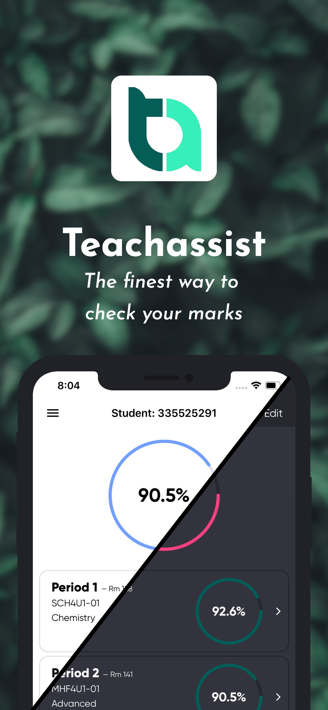
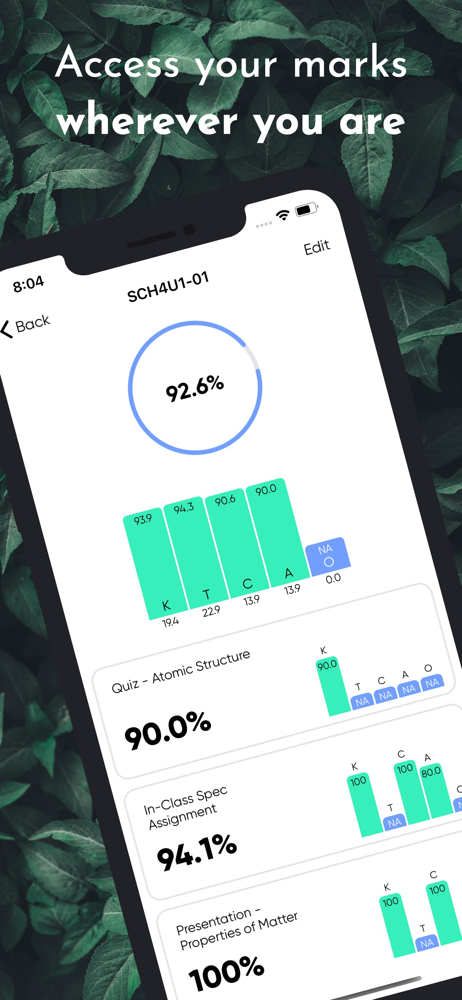
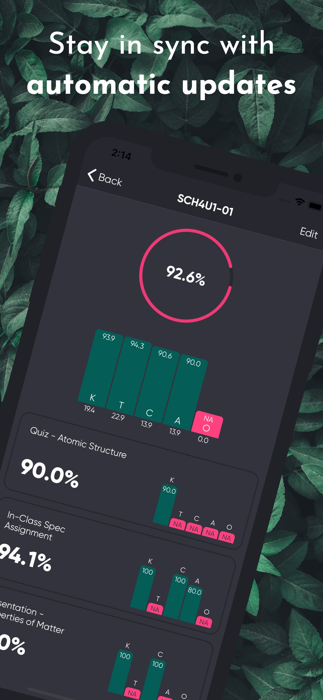
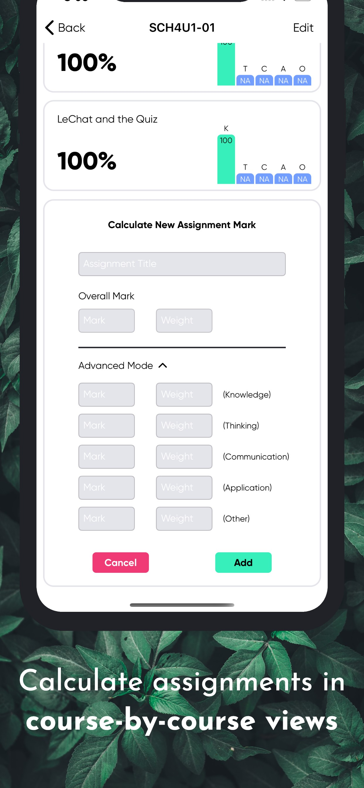
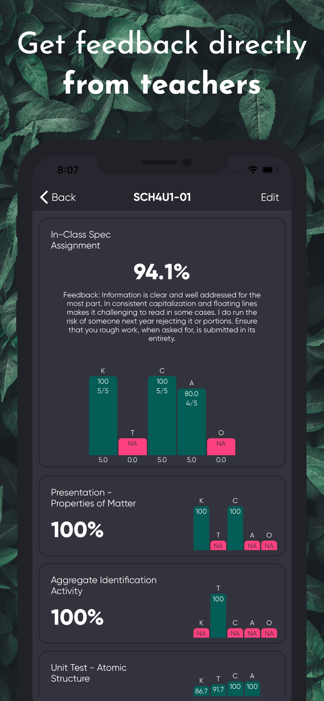

# Teach-Assist-IOS
The unofficial Teachassist app aims to provide YRDSB students with an convenient and accessible way to view their grades. Teachassist will automatically sync with the website to bring you your latest marks. Manage courses individually to easily identify your personal needs and strengths. Teachassist's assignment view brings feedback directly from teachers, to you.

If you encounter a bug, please report it using either the bug report button in the sideview, or by emailing the Teachassist app development team directly at taappyrdsb@gmail.com. If you have any suggestions on how the app could improve, we'd love to hear from you!

This app is specifically designed for student use only and is not endorsed by either Teachassist or YRDSB.

# Key features:

• No ads
• Dark and light theme
• Course averages
• Assignment averages
• Assignment calculator
• Faster loading times
• Improved look and feel
• Ability to temporarily remove assignments and courses to measure their impact
• Device-side encrypted password

# Download
Avaliable now on the App Store

  

# Screenshots

  
  
  
  
  

 
 
