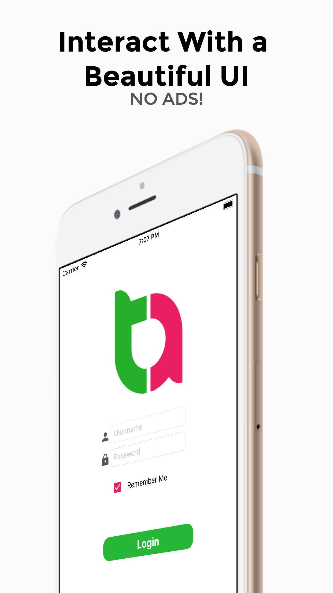
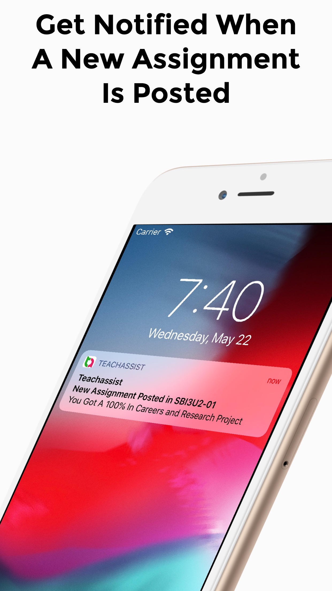
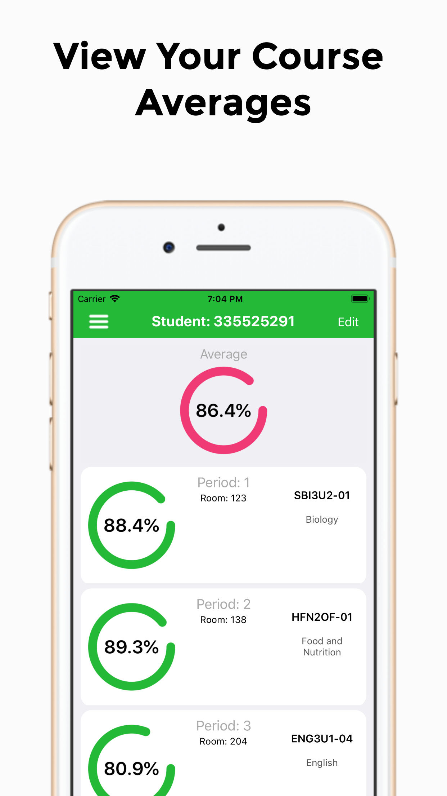
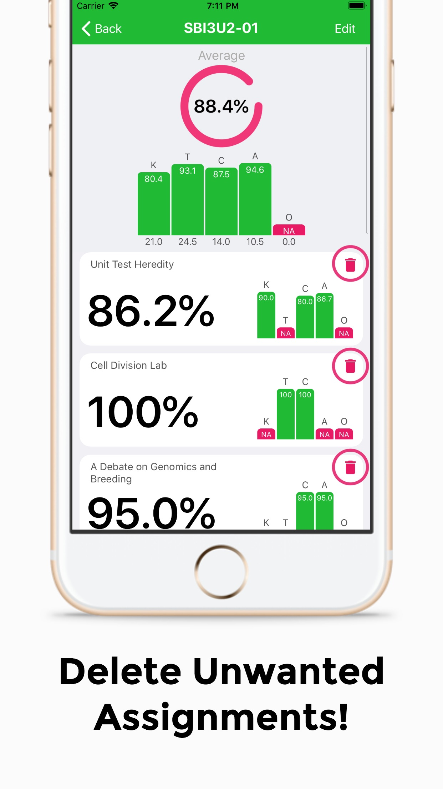
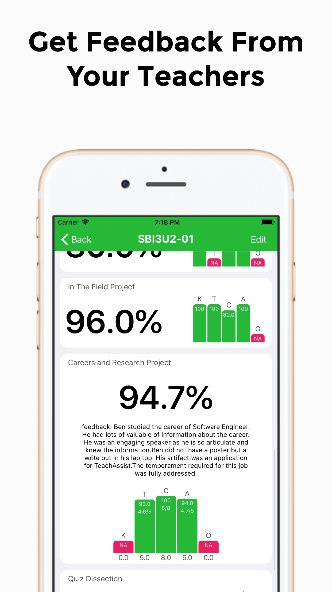

# Teach-Assist-IOS
The unofficial app for Teachassist aims to provide students with a friendly user experience, along with beautiful UI and improved loading times. Ever wanted to get notified when your teacher posted that new assignment? Well now you can! Want to know what you average would be without a certain course or assignment? Well now the edit feature allows you to see that! Want to know what you got on that last test? the Teachassist app will tell you your overall average. 

Note: This app may contain bugs or may not work entirely for some users. If that is the case we would appreciate an email to taappyrdsb@gmail.com highlighting the issue your having. We will try our best to fix the issue!

# Key features:

  - No ads
  - Notifications
  - Course averages
  - Assignment averages
  - Semester averages
  - Quick loading times

# Download
Avaliable now on the App Store

  

# Screenshots

  
  
  
  
  

 
 
